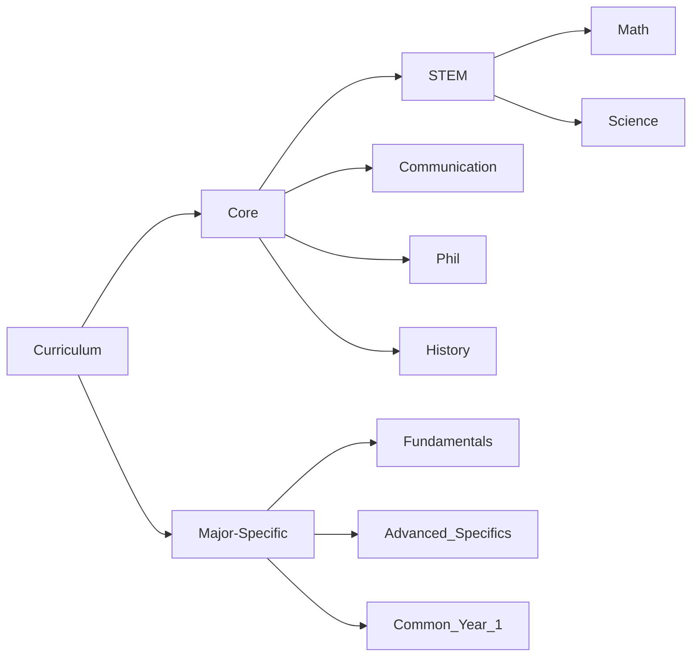

# Top-Down Design
This starts with the most general ideas of a design. The idea is divided into next-most general idea. This process is repeated until the ideas are specific. This results in a **hierarchy**.

This example shows part of a curriculum hierarch. 

## Advantages
In general, hierarchies can manage complexity

**Coherency**
- Each node contains a clear concept
- There is ideally not overlap between ideas in nodes
- Clear relationship between levels
**Conceptual Separation**
- Only have to think about one node at a time and how it relates to its connections
- Allows for localized comprehension of a large tree

# Disadvantages

**Artificial Boundaries**
- There can be too much conceptual separation between topics which are very similar
**Cuts Relationships**
- Many times there are interconnections and relationships that are not captured in a rigid hierarchy.

## Computing Terminology
- Tree - A hierarchy of connected nodes
- Node - An individual element in a tree
	- Parent - The node above and connected to a node
	- Children - The node(s) bellow and connected to a node
- Root - The top node of a tree; has no parents 
- Leaf - A node at the bottom of the tree; has no children